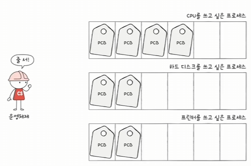
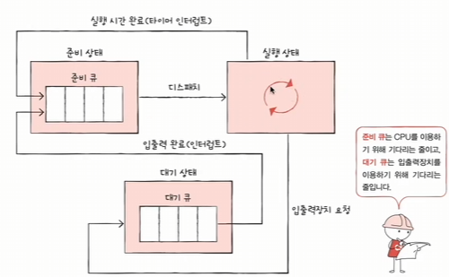
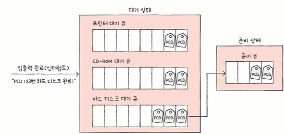
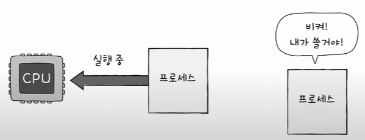
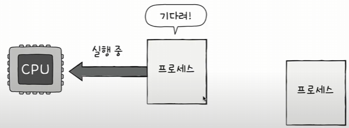

## CPU 스케쥴링

**운영체제가 프로세스들에게 공정하고 합리적으로 CPU 자원을 배분하는 것**

그럼 가장 공정한 CPU 스케쥴링이랑 무엇인가?

일차적으로 생각해봤을 때 CPU를 필요로하는 순서대로 프로세스들에게 자원을 할당하면 되지않을까?

그런데 프로세스 사이에는 **우선순위**가 있다. 빨리 실행해야 하는것이 있다. 

그래서 무조건적으로 먼저 CPU를 필요로하는 프로세스가 먼저 할당받는것이 효율적이진 못한다.

**입출력 작업이 많은 프로세스의 우선순위는 CPU 작업이 많은 프로세스의 우선순위보다 높다**.

-> 왜냐하면 입출력 작업이 많은 프로세스들은 입출력 장치가 작업이 끝날 때 까지 **대기상태**로 진입하기 때문이다. 해당 **유휴시간**동안 다른 프로세스를 실행하면 그만이다.

이러한 **프로세스 우선순위는 PCB**에 저장되어 있다.

그리고 이러한 프로세스들의 우선순위를 결정짓는 자료구조가 `스케쥴링 큐` 이다.

스케쥴링 큐는 반드시 선입선출일 필요는 없다.

스케쥴링 큐의 대표적인 예시가 `준비큐`와 `대기큐` 이다.

`준비큐`라는것은 CPU를 할당받을 준비가된 프로세스들이 모여있는 자료구조를 의미하며, 일반적으로 일정 시간만큼의 CPU를 사용한 뒤 그 시간이 넘어서서 작업이 끝나지 않는다면 타임아웃 인터럽트가 발생하고 준비큐로 이동한다.

`대기큐`는 CPU를 사용하다가 입출력 장치호출 등의 이유로 CPU를 더이상 사용하지 않게 되었을 때, 해당 장치에 대해서 요청을 보낸 후 대기큐에 진입하고
입출력장치 사용이 끝난 후 인터럽트 발생 시 해당 프로세스는 대기큐에서 준비큐로 이동하게 된다.

### 기아현상

우선 순위 알고리즘의 경우, 어떠한 프로세스가 다른 프로세스들보다도 지속적으로 우선순위가 밀릴수 있다. 이러한 현상을 기아 현상이라고 한다.

이러한 기아 현상을 막기 위해서는 `에이징 기법`이 대표적이며, 방법으로 단순하게는 CPU를 할당받은 적이 있으면 같은 기준에서도 우선순위를 뒤로 미루는 방식이다.

### 선점형과 비선점형 스케쥴링 

- 선점형 스케쥴링: 현재 CPU를 사용 중인 프로세스로 부터 CPU 자원을 `빼앗아` 다른 프로세스에 할당

    - 

    - 프로세스 상태 전이에서, 타이머 인터럽트가 발생한 경우 다른 프로세스가 CPU를 선점하는것이 선점형 스케쥴링의 예시이다.

        - 장점: 프로세스들에게 골고루 자원을 배분할 수 있다.
        - 단점: 컨텍스트 스위칭의 오버헤드가 자주 발생할 수 있다.

    - 일정한 타임슬라이스만큼을 지정하고, 그 슬라이스 만큼을 다 사용하면 젤 우선순위 밖으로 밀리는 알고리즘인 RR(Round-Robine) 알고리즘 있다. 기본적으로 정해진 시간만큼만 각 프로세스가 할당받고, 해당 프로세스가 정해진 시간동안 처리되지 못한다면 다시 스케쥴링 큐 젤 뒤로 이동하게 되는 알고리즘 이다.
        - 이 알고리즘은 결국 타임슬라이스의 크기에 따라 크게 달라진다.
        - 너무 작게 설정한 경우: 생각보다 각 프로세스들이 완전히 처리되지 못하고 문맥교환 오버헤드가 커진다.
        - 너무 크게 설정한 경우: 응답시간이 너무 길어진다.

- RR을 생각해보면 타임슬라이스를 적용시키고 남은 시간이라는게 존재하는데,
    남은 시간 또한 우선순위의 고려대상으로 생각하면 어떨까?
    이런 생각으로 바로 SRF(Shortest job Remaining First) 알고리즘이 있다.
    이는 RR + SJF 로서 라운드로빈으로 작동하되, 우선순위의 결정요인중에 남은 시간이 작은 알고리즘이 먼저 선점되도록 처리한다.

- 다음으로는 준비큐 자체를 여러개 둬서 각각 큐마다의 레벨을 부여하고 높은 레벨의 큐를 먼저 다 처리하는 멀티레벨 큐 방식이 있다.
    해당 방식에서는 프로세스의 종류(CPU 바운드 프로세스, I/O 바운드 프로세스) 에 따라 큐를 나누게 되고, 일반적으로 CPU를 좀 덜쓰는 I/O 바운드 프로세스들이 높은 레벨의 큐에     `영구적`으로 삽입된다. 그리고 높은 레벨의 큐부터 먼저 처리한다.

    - 이 방식을 사용하면 다양한 우선순위를 큐마다 매길 수 있고, 큐레벨로 우선순위가 나눠져서 좀더 디테일하게 우선순위 알고리즘을 만들 수 잇다.
    - 하지만 큐끼리의 정보교환이 이루어지지 않기 때문에 멀티레벨 큐 방식은 기아현상을 막기 힘들다.

- 이렇게 되어서 나온것이 다단계 피드백 큐 방식이 있다.
    처음에는 가장 레벨이 높은 큐에 (가장 우선순위가 빠른 레벨을 가진 큐)에 프로세스들이 삽입되고, 여기서 처리되지 못한 프로세스는 아래 레벨의 큐로 이동한다. 반대로 실행시간이 짧아진 프로세스는 윗 레벨의 큐로 승격되기도 한다.

    - 이러한 큐 사이의 이동이 자유롭기 때문에 기아현상을 다단계 큐 알고리즘보다는 줄일 수 있다.
    그리고 자연스럽게 I/O 중심적인 프로세스들은 레벨이 높은 큐에 모여있고, CPU 중심적인 프로세스는 아래 레벨의 큐로 이동하게 된다.

- 비선점형 스케쥴링: 현재 CPU를 사용 중인 프로세스의 작업이 끝날 때 까지 프로세스 `기다리기`

    - 

        - 장점: 컨텍스트 스위칭의 오버헤드가 적다.
        - 단점: 모든 프로세스가 골고루 자원을 이용하기 어렵다.

    - 먼저 단순한 알고리즘으로 FCFS (First Come First Served) 알고리즘 이 있다.
        해당 알고리즘은 먼저 큐에 진입한 프로세스에게 먼저 CPU를 제공하는 알고리즘으로 단순하다

        - 무조건 진입순서대로 실행되기 때문에 앞선 프로세스가 필요한 시간보다 더 짧은 프로세스가 늦게 진입하면 할수록 더 짧은 프로세스는 길게 기다려야 한다.
        이러한 상황을 `호위효과`라고 한다.

    - 이러한 `호위효과`를 해결하기 위해서 SJF(Shortest Job First) 최단 작업 우선 알고리즘이 있다.
        이는 작업시간이 짧은 프로세스를 먼저 처리하는 알고리즘이다.
        SJF는 선점으로도 구현이 가능하고, 비선점으로도 구현이 가능하다.
    
        - 하지만 SJF의 경우 CPU 사용시간이 매우 짧지만 입출력 시간이 매우 긴 경우가 있다.
        SJF로는 물론 CPU 사용시간 기준으로 우선순위를 매기기 때문에, 입출력시간까지는 예상할 수 없어서 실행시간을 정확하게 예측하기 어렵다.

    - HRN 스케쥴링이 있다. 이는 우선순위 스케쥴링 방식에서 기아현상을 해결하기 위한 스케쥴링 기법으로 대기시간을 고려하여 우선순위를 매긴다.
        - 따라서 우선순위 공식은 다음과 같다.
        - 
        - `(대기시간 + 실행시간) / 실행시간`

궁금했던것 -> 선점 비선점을 나누는 기준은?

비선점에 있는 SJF 와 FCFS 그리고 HRN은 일단 CPU를 할당받으면 자기 예측된 실행시간만큼 무조건 사용해야 한다. 그사이에 다른 우선순위가 있더라도 대기해야 한다.

선점의 MLQ, MLFQ, RR의 경우 타임슬라이스만큼만 사용하고, 그 사용이 끝나면 타임아웃 인터럽트에 의해 사용을 중단시킬 수 있다.

