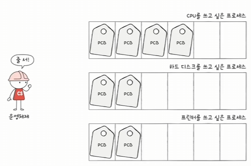
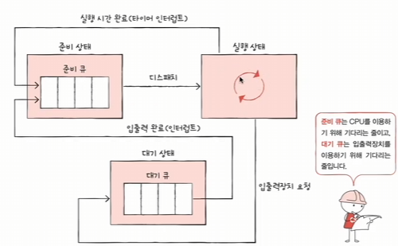
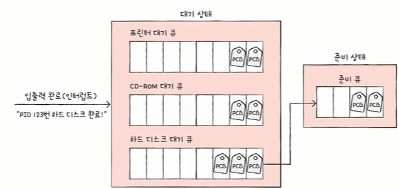
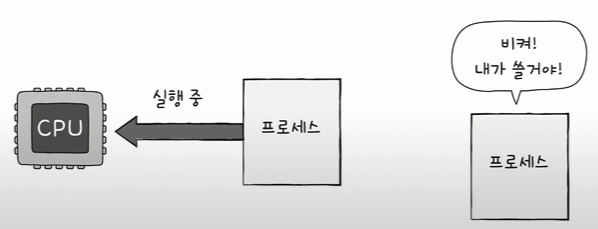
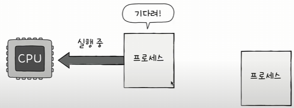

## CPU 스케쥴링

**운영체제가 프로세스들에게 공정하고 합리적으로 CPU 자원을 배분하는 것**

그럼 가장 공정한 CPU 스케쥴링이랑 무엇인가?

일차적으로 생각해봤을 때 CPU를 필요로하는 순서대로 프로세스들에게 자원을 할당하면 되지않을까?

그런데 프로세스 사이에는 **우선순위**가 있다. 빨리 실행해야 하는것이 있다. 

그래서 무조건적으로 먼저 CPU를 필요로하는 프로세스가 먼저 할당받는것이 효율적이진 못한다.

**입출력 작업이 많은 프로세스의 우선순위는 CPU 작업이 많은 프로세스의 우선순위보다 높다**.

-> 왜냐하면 입출력 작업이 많은 프로세스들은 입출력 장치가 작업이 끝날 때 까지 **대기상태**로 진입하기 때문이다. 해당 **유휴시간**동안 다른 프로세스를 실행하면 그만이다.

이러한 **프로세스 우선순위는 PCB**에 저장되어 있다.

그리고 이러한 프로세스들의 우선순위를 결정짓는 자료구조가 `스케쥴링 큐` 이다.

스케쥴링 큐는 반드시 선입선출일 필요는 없다.

스케쥴링 큐의 대표적인 예시가 `준비큐`와 `대기큐` 이다.

`준비큐`는 프로세스 상태 중 준비 상태에 접어든 프로세스들이 실행되기전 대기하는 큐 이고 `대기큐`는 프로세스중 입출력 장치를 사용하기위해 대기하는 큐이다.

- 대기큐는 당연하게도 CPU 자원을 점유할 이유가 없기 때문에 존재한다.

### 선점형과 비선점형 스케쥴링 

- 선점형 스케쥴링: 현재 CPU를 사용 중인 프로세스로 부터 CPU 자원을 `빼앗아` 다른 프로세스에 할당

    - 

    - 프로세스 상태 전이에서, 타이머 인터럽트가 발생한 경우 다른 프로세스가 CPU를 선점하는것이 선점형 스케쥴링의 예시이다.

        - 장점: 프로세스들에게 골고루 자원을 배분할 수 있다.
        - 단점: 컨텍스트 스위칭의 오버헤드가 자주 발생할 수 있다.

- 비선점형 스케쥴링: 현재 CPI를 사용 중인 프로세스의 작업이 끝날 때 까지 프로세스 `기다리기`

    - 

        - 장점: 컨텍스트 스위칭의 오버헤드가 적다.
        - 단점: 모든 프로세스가 골고루 자원을 이용하기 어렵다.

    - FCFS(First Come First Served) 스케쥴링 
        - 준비 큐에 삽입된 순서대로 처리하는 비선점 스케줄링
        - 단점: 프로세스들이 기다리는 시간이 매우 길어질 수 있다는 부작용 (= 호위 효과)
            - 이게 무슨말이냐? 정말 빨리 끝나는 프로세스들 보다 엄청 느린 실행시간을 가진 프로세스가 먼저 들어가서 점유하고 있을 때 모두가 기다려야 한다.

    - SJF (Shortest Job First) 스케쥴링
        - 그러면 걍 실행시간 빨리 끝나는 애들 순서로 스케쥴링 하면 되는거 아님?
        - 얘는 선점형으로도 구현될 수도 있다고 한다.
    
    - RR (Round Robin) 스케쥴링
        - 선입 선처리 스케줄링 + 타임 슬라이스 인 기법
        - 타임 슬라이스: 각 프로세스가 CPU를 사용할 수 있는 정해진 시간
        - 즉, 정해진 시간만큼만 돌아가며 CPU를 이용하는 선점형 스케쥴링
            - 타임슬라이스 < 남은 실행시간, 컨텍스트 스위칭 후 큐 뒤에 삽입
            - 타임슬라이스 > 작은 실행시간, 끝나자마자 바로 스위칭
        - 적절한 `타임슬라이스`의 크기를 정하는것이 중요함
            - 너무 큰 타임슬라이스는 호위 효과를 일으킴
            - 너무 작은 슬라이스는 자꾸만 스위칭이 일어나서 오버헤드 발생

    - SRT(Shortest Remaining Time) 스케쥴링
        - RR + SJF 스케쥴링
        - 즉, 정해진 시간만큼 CPU를 사용하되, 남은 작업시간이 적은 프로세스가 우선됨

    - 우선순위 스케쥴링
        - SJF와 SRT는 이 스케쥴링 기법에 포함된다.
        - 이놈에 우선순위를 사용하는 스케쥴링의 고질병 -> 기아현상
            - 자꾸만 스케쥴링 순서상 뒤로 밀리는 프로세스가 발생하는 문제를 뜻한다.

            - 이를 방지하는 방법
                - 에이징 기법: 오랫동안 대기한 우선순위를 점차 높이는 방식

    - 다단계 큐 스케쥴링
        - 우선순위 별로 준비 큐를 여러 개 사용하는 스케줄링 방식
            - 우선순위가 가장 높은 큐에 있는 프로세스를 먼저 처리
            - 우선순위가 가장 높은 큐가 비어있으면 그 다음 우선순위 큐에 있는 프로세스 처리

        - 단점: 큐 간에 프로세스를 이동시킬 수 없으므로 기아현상 발생가능

    - 다단계 피드백 큐 스케쥴링
        - 젤 처음에 가장 높은 우선순위 큐에 배치되어 실행된다.
        - 만약 타임슬라이스 만큼 실행되지 못한 경우, 이전 큐보다 높은 우선순위의 큐에 배치된다.
        - 따라서 CPU 집중 프로세스의 우선순위는 입출력 집중 프로세스보다 우선순위가 낮아진다.
        - 여기서 에이징 기법 또한 적용이 가능하며, 에이징을 먹이면서 우선순위가 너무 낮아진 프로세스의 우선순위를 높일 수 있다.

