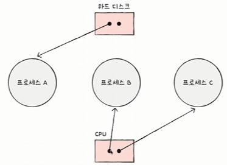

## 교착 상태 (`Dead Lock`)

교착상태가 발생했을 때의 상황을 정확히 표현해보기

- 자원할당 그래프를 사용한다.

    - 프로세스는 동그라미로 표현하고, 자원은 사각형으로 표현, 그리고 해당 자원의 개수를 사각형 내에 점의 개수로 표시
    - 
    - 프로세스가 어떤 자원을 기다리고 있다면 프로세스에서 자원으로 화살표를 표시

**교착 상태가 발생할 조건**

1. 상호 배제: 한 프로세스가 사용하는 자원을 다른 프로세스가 사용할 수 없는 상태

2. 점유와 대기: 자원을 할당받은 상태에서 다른 자원을 할당 받기를 기다리는 상태

3. 비선점: 어떤 프로세스도 다른 프로세스의 자원을 강제로 빼앗지 못하는 상태 -> CPU 스케쥴링에서의 선점 비선점을 생각하기

4. 원형 대기: 프로세스들이 원의 형태로 자원을 대기하는 상태

## 교착 상태 해결법

- 예방: 애초에 교착 상태가 발생하지 않도록
    - 4개의 교착 상태 발생조건(상호 배제, 점유와 대기, 비선점, 원형 대기) 중 하나를 없애기

        - 상호 배제를 없애기: 모든 자원을 공유 가능하게 만든다.
        - 점유와 대기를 없애기: 특정 프로세스에 자원을 모두 할당하거나, 아예 할당하지 않는 방식으로 배분
            - 자원의 활용율을 낮출 수 있음
        - 비선점 조건을 없애기: 선점이 가능한 자원에 한해 효과적
            - CPU자원: 타이머 인터럽트를 통해 강제로 다른 프로세스가 점유하도록 유도
            - 모든 자원이 선점 가능한 것이 아니다.
        - 원형 대기 조건을 없애기: 자원에 번호를 붙이고 오름차순으로 할당하면 원형 대기는 발생하지 않음
            - 모든 자원에 번호를 붙이는 것은 어려운 작업
            - 어떤 자원에 어떤 번호를 붙이느냐에 따라 활용률이 달라진다.

- 회피
    - 무분별한 자원 할당으로 인해 발생했다고 간주
    - 배분 할 수 있는 자원의 양을 고려해서 교착 상태가 발생하지 않을 만큼만 배분
    - 안전 순서열: 교착 상태 없이 안전하게 프로세스들에게 자원을 할당할 수 있는 순서
    - 안전 상태: 교착 상태 없이 모든 프로세스가 자원을 할당 받고 종료될 수 있는 상태
    - 불안전 상태: 교착 상태가 발생할 수도 있는 상태
        - 
        - 위의 예시 상황에서 P2 -> P1 -> P3 순서가 안전 순서열로서 안전 상태가 된다.
            - 최악의 경우를 생각해보자 (모든 프로세스가 최대 개수를 원할 때)
            - P2에게 2개의 자원을 물려주고 P2가 작업이 끝나면 4개의 자원과 남은 자원 1개를 합해 P1에 물려주고 P1이 끝나면 남은 자원을 P3에게 물려주면 된다.

        - 그런데 저기서 남은 3개의 자원중에 하나라도 순서에 안맞게 배분한다면? 교착 상태가 발생할 수 있다.

    - 즉, 항시 안전 상태를 유지하도록 자원을 할당하는 방식이다.
        - 은행원 알고리즘

- 검출 후 회복

    - 교착 상태의 발생을 인정하고 사후에 조치하는 방식
    - 선점을 통한 회복, 프로세스 강제 종료를 통한 회복이 있다.
        - 프로세스 강제 종료
            - 교착 상태가 해결될때 까지 프로세스들을 하나씩 강제종료
            - 혹은 모든 프로세스를 강제종료
        - 선점을 통한 회복: 교착 상태가 해결될 때 까지 한 프로세스씩 자원을 몰아주는 방식