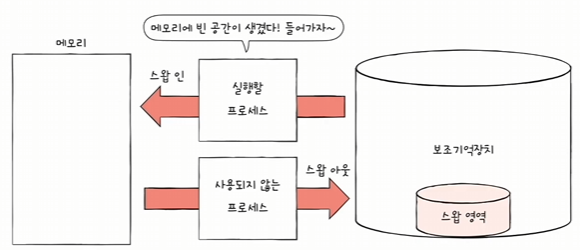
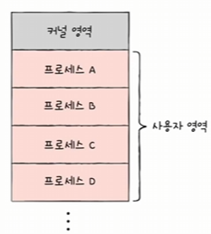
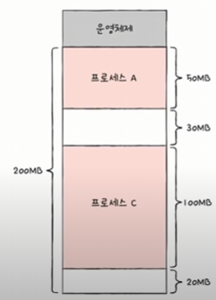
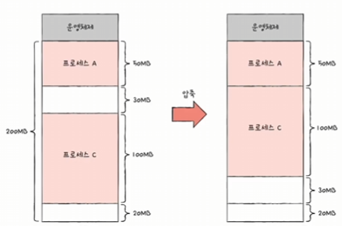
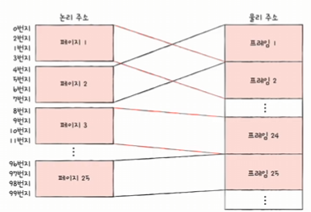
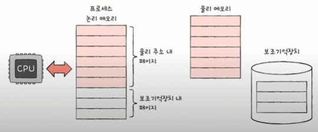
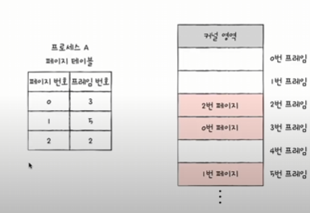
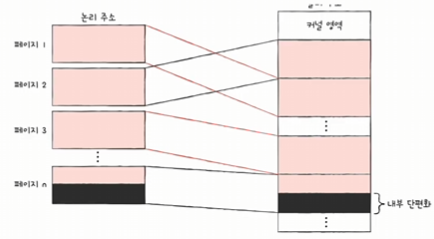

## 메모리

### 스와핑

현재 사용되지 않는 프로세스들을 보조기억장치의 일부 영역으로 쫓아내고

그렇게 생긴 빈 공간에 새 프로세스를 적재



스와핑은 어떨 때 사용할까 ?

- 프로세스들이 요구하는 메모리 공간 크기 > 실제 메모리 크기

### 메모리 할당

프로세스는 메모리의 빈 공간에 할당되어야 한다.

그 방법으로 `최초 적합`, `최적 적합`, `최악 적합` 으로 세 가지 방식이 있다.

### 연속 메모리 할당: 프로세스에 연속적인 메모리 공간을 할당

**최초 적합(`First-Fit`)**

운영체제가 메모리 내의 빈 공간을 순서대로 검색하다가 적재 가능한 공간을 발견하면 프로세스를 배치함

- 검색 시간 최소화, 빠른 할당

**최적 적합(`Best-Fit`)**

운영체제가 빈 공간을 모두 검색해본 뒤, 적재 가능한 가장 작은 공간에 할당

**최악 적합(`Worst-Fit`)**

운영체제가 빈 공간을 모두 검색해본 뒤, 적재 가능한 가장 큰 공간에 할당



사실, 언뜻 보기엔 좋아보여도 이렇게 연속적으로 프로세스를 메모리에 할당하는 방식은 효율적이지 않음

그 이유는 `외부 단편화(external fragmentation)`이라는 문제가 발생하기 때문

### 외부 단편화(`External Fragment`)

```
Case

사용자 영역이 200MB 일 때

크기가 50MB인 프로세스 A, 30MB인 프로세스 B, 100MB인 프로세스 C, 20MB인 프로세스 D를 차례대로 적재해야 한다면?
```
위 상황에서 프로세스 B, D가 실행이 종료되어 메모리가 반환되었다면?



빈 공간에 총 합은 50MB, 하지만 프로세스 50MB짜리를 할당 가능한가요? No

이러한 문제를 `외부 단편화` 라고 부른다.

외부 단편화 해결방법

- `메모리 압축(Compaction)`: 여기저기 흩어져 있는 빈 공간들을 하나로 모으는 방식으로, 재배치 시켜 흩어져 있는 작은 빈 공간들을 하나의 큰 빈 공간으로 만드는 방법
    - 

하지만 위의 방법으로는 `재배치`에 따른 오버헤드로 인해 해당 프로세스가 원래 수행해야 할 일을 일시 중단해야 하는 문제가 발생한다.

따라서 현대 메모리관리법인 `페이징`이 등장하게 된다.

## 페이징을 통한 가상 메모리 관리

`연속적인 메모리 할당`은 `외부 단편화` 문제를 야기시키고, 이를 메모리 압축(`Compaction`)으로 해결하려니 `재배치`에 대한 오버헤드가 너무 크다.

`따라서 페이징을 통한 가상 메모리 관리`를 통해 `외부 단편화` 문제를 해결한다.

- 가상 메모리: 실행되고자 하는 프로세스가 필요하는 메모리의 양이 남은 메모리보다 크더라도 프로세스의 일부 정보만을 메모리에 적재하여, 남은 메모리보다 더 많은 프로세스를 실행 가능케 하는 기술

    - 이를 구현한 것이 `페이징`, `세그멘테이션`이 있다.


이전까지의 문제는 `프로세스가 필요한 양 만큼만 연속적으로 메모리를 할당` 하였다.

그로 인해 `외부 단편화`가 발생되었는데, `페이징`은 `모든 프로세스를 일정 크기로 자르고, 이를 불연속적으로 할당 하는 것` 이다.

`페이징(Paging)`
- 프로세스의 `논리 주소 공간을 페이지`라는 일정 단위로 자르고

- 메모리의 `물리 주소 공간을 프레임`이라는 페이지와 동일한 일정한 단위로 자른 뒤, `페이지를 프레임에 할당하는 가상 메모리 관리 기법`

- 

페이징에서도 스와핑은 충분히 가능하다.

- 작동 방식은 페이징을 안쓰더라도 동일하다. `페이지 단위`가 될 뿐이다.

    - 즉, 프로세스는 메모리공간 내 일부 페이지에 대하여 보조기억장치의 스왑공간에 적재된 체로 실행 되기도 한다.
    - 

    - 따라서 프로세스가 필요한 메모리가 남은 메모리보다 크더라도 실행이 가능하게 된다.

그런데 페이징에서 `논리 주소 공간`은 `페이지 단위`로 자르고, 이를 또 일정한 단위로 잘린 물리 메모리 내에 `프레임`에 `불 연속적`으로 할당한다고 했다.

CPU가 해당 프로세스를 실행하려고 봤더니 `연속 메모리 할당때`에는 프로세스마다 `시작주소 + 변위`로 찾을 수 있겠지만 

`불 연속적`으로 논리 메모리 구조인 `페이지`를 `물리메모리 프레임`에 할당하는 `페이징 기법`에서는 하나의 프로세스를 이루는 `물리 메모리 파편`을 찾기가 힘들다.

그래서 `페이지 테이블`이 있다.

현재 어떤 프로세스의 어떤 페이지가 어떤 프레임과 연결되어 있는지 찾을 수 있는 테이블

- 즉, 실제 메모리는 프레임과 페이지로 연결관계로 되어있어 하나의 프로세스에 대하여 불연속적일지라도
- CPU 입장에서는 적어도 연속적으로 보이도록 배치하는 방법

- 이러한 페이지 테이블은 프로세스 마다 존재하게 된다.
    - 프로세스 마다 이루는 물리 메모리공간이 프레임단위로 불연속적이기 때문에 프로세스 마다 있어야 한다.

    - 

    - 따라서 `CPU 입장`에서는 `페이지 테이블`을 보고 `순차적`으로 페이지들을 실행하면 그만이다.

페이징은 `내부 단편화`가 있을 수 있다.

```
페이지의 크기가 10KB, 프로세스의 크기가 108KB 일 때를 생각해보면

논리 메모리 공간에서는 10KB 크기로 짤릴 것이고 프로세스에게 필요한 만큼을 할당해주기 위해서 11개의 페이지를 할당 할 것이다.

그런데 110KB 를 할당하면..
```


2KB: 내부 단편화가 발생!

### PTBR (`Page Table Base Register`)

CPU가 프로세스를 실행하기 앞서, 프로세스의 `페이지 테이블`을 살펴 볼 것인데

이 `페이지 테이블의 위치가 어딨는지 알아야 할 것`이다. 이것을 `기억`해 두는 특별한 레지스터가 바로 `PTBR`이다.

근데 `페이지 테이블`이 `메모리위에 있게 되면` 메모리 접근시간이 `2배`가 된다.

- 그 이유로, CPU가 해당 프로세스를 실행하면서 프로세스가 점유하고 있는 메모리에 접근해야 할 때, 페이지 테이블을 거쳐야 한다.

    - 이 때 페이지 테이블에 접근하기 위해 `PTBR`을 통해 `메모리 위에 있는 페이지 테이블`에 접근하고,

    - 얻은 페이지 테이블에서 `현재 가진 페이지 정보에 따른 물리 메모리에 접근하기 위해 한번 더 메모리에 접근`하게 된다.

그래서 `TLB`를 통해 메모리 접근횟수를 줄일 수 있다.

`TLB`: CPU 곁에 있으며, 페이지 테이블을 위한 캐시 메모리

- 페이지 테이블의 일부를 가져와서 저장

    - 따라서 자주사용되는 페이지 테이블 일부가 저장되어 있으므로 곧바로 논리 메모리내에 페이지에 접근이 가능케 된다.


### 페이지 테이블의 심화내용

페이지 테이블은 프로세스 마다 있으며, 페이징 기법에 의한 불연속적인 프레임들을 하나의 연속적인 페이지로 관리할 수 있게 된다.

그리고 이러한 페이지 테이블 내에는 결국 페이지와 연결된 프레임이 매핑테이블로 이루어져 있는데,

여기서 매핑 테이블을 이루는 데이터 하나하나를 페이지 테이블 엔트리라고 부른다.

중요한 점은 만약 CPU가 논리적인 주소인 몇번 페이지에 일정 변위만큼 떨어져있는 메모리 값을 읽어오려고 한다면

페이지 테이블 내에 이어진 프레임을 찾으면 되고, 변위를 동일하게 해당 프레임번호에서 더하면 읽을 수 있다.

이게 가능한 이유는 프레임의 크기단위와 페이지의 크기단위가 동일하기 때문이다.

이러한 페이지 테이블은 단순히 페이지번호 - 프레임 번호 로만 이루어져 있지 않고, 사실 몇가지 추가 비트들이 있다.

이는 OS마다 조금씩 편차가 있다.

### 유효 비트

유효 비트는 현재 페이지테이블 내에 존재하는 해당 페이지가 메모리 위에 있는지 여부를 나타내는 비트이다.

만약 없다면 Page Fault 인터럽트를 발생시켜서 해당 페이지의 내용을 스왑된 보조기억장치로부터 읽어들여 메모리위에 올리고 유효비트를 켠다.

### 보호 비트

이는 페이지의 속성을 지키기위한 비트로서, 예를들어 읽기전용일 경우, 쓰기 전용일 경우 이런 경우에 따라 비트를 켜고 끈다.

### 참조 비트

CPU 가 한번이라도 참조한 적 이 있는지 여부를 나타내는 비트이다.

### 수정 비트

수정 비트는 이 페이지에 들어있는 값이 수정 된 적 있는지 여부를 나타내며, 이는 페이지단위로 스왑될 때 중요하다.

왜냐하면 수정비트가 켜져있는 경우에는, 보조기억장치에 있는 페이지의 값도 수정해야 하기 때문이다.

## CopyOnWrite 와 계층적 페이징

먼저 fork() 라는 시스템 콜을 통해 자신과 동일한 프로세스를 만들어 낼 수있다.

하지만 기본적으로는 프로세스들은 메모리를 공유하지 않기 때문에 계속해서 fork()를 하게되면 금방 메모리를 꽉채우게 된다.

여기서 CopyOnWrite를 하게 되면, 프로세스에서 fork()가 발생하더라도 메모리를 새롭게 할당하지 않는다.

기존 부모 프로세스와 동일한 프레임을 갖고 있다가, 부모든 자식이든 어디 페이지에서 수정이 발생하면 그 페이지에 대한 내용을 새로운 프레임에 복사하고 수정하게 된다.

이것으로 메모리를 절약할 수 있다.

또한 계층적 페이징으로도 메모리를 절약 할 수 있다.

이는 페이지로 나눠진 페이지들을 또 페이지기법으로 나누는 것을 의미한다.

페이지들을 묶어서 하나의 단위로서 사용하는 것이 된다. 이 때 나누고있는 페이지를 아우터 페이지라고 부른다.

그렇게 되면 하나의 테이블 엔트리에서 페이지쪽이 기존에는 <페이지번호, 변위> 였다면 이제는 아우터 <페이지번호, 페이지 번호, 변위> 가 된다.

그래서 실제 메모리위에 페이지 테이블 엔트리의 크기는 더욱 작게 유지할 수 있게 된다.


