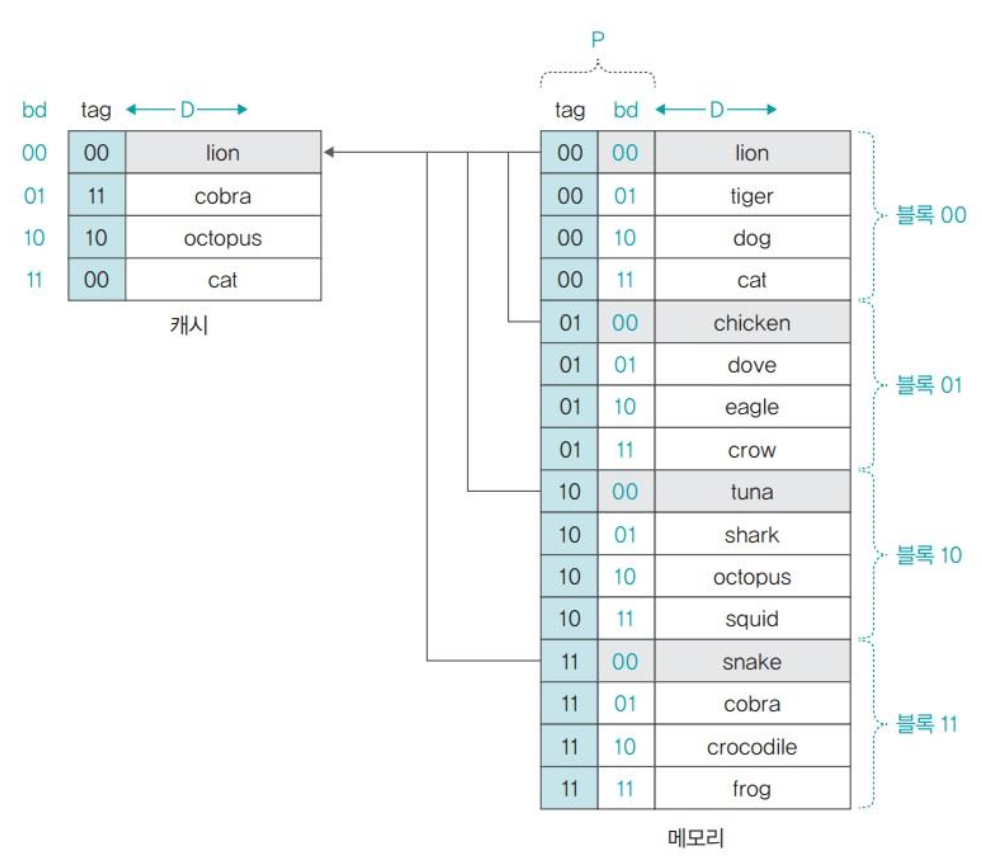
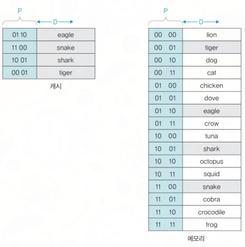
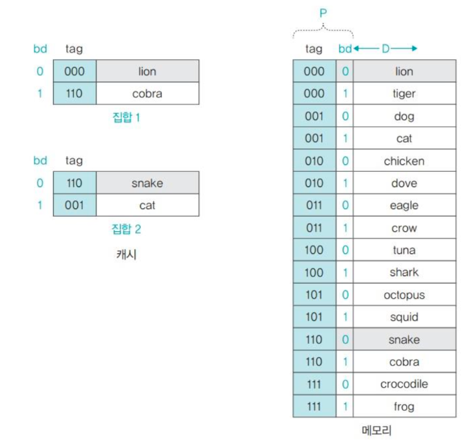

## 캐시메모리

캐시메모리는 CPU와 메인메모리 사이의 고속 버퍼로서 사용되며, 레지스터보다는 느리지만, 용량이 크고 메인메모리보다는 속도면에서 빠르다.

캐시에 종류에는 보통 CPU 코어 내에 존재하는 L1 캐시, L1보다는 느린 L2 캐시, 그리고 코어들이 공유하는 L3 캐시로 이루어져 있다.

### 캐시의 작동원리

캐시 메모리는 지역성의 원리를 기반으로 동작한다.

지역성에는 다음과 같이 `시간적 지역성`과 `공간적 지역성`으로 나눌 수 있다.

- 시간적 지역성: 최근에 사용된 명령어는 다시금 사용될 가능성이 높다는 것
- 공간적 지역성: 특정 주소에 값을 사용하였다면, 그 주변 주소의 값들도 사용할 가능성이 높다는 것.

캐시 메모리는 캐시 라인이라는 단위로 관리된다.

**캐시 라인**은 캐시 메모리 내에 `메모리 블록`의 크기 단위이다.

그러한 캐시 메모리 내에 CPU가 지금 원하는 데이터가 존재하지 않는 경우, `캐시 미스` 라고 하며 캐시 미스가 발생 한 경우 메인 메모리에서 데이터를 읽어와야 한다.

캐시 미스에는 다음과 같은 3가지가 있다.

- Cold Miss: 처음 데이터를 요청 할 때 발생하는 미스로서 당연하게 발생한다.

- Capacity Miss: 캐시 용량초과로 인해 캐시 메모리내에 데이터 교체가 발생하는 경우를 말한다.

- Conflict Miss: 하나의 캐시라인에 여러 종류의 데이터가 올 수 있는 경우로서 주로 `직접매핑`시 발생한다.

그러한 캐시라인이자 즉 캐시 메모리의 크기는 메인메모리에 비해 작기 때문에 모든 주소를 캐시라인에 입력할 수 없다.

따라서 3가지의 주소 매핑 방식이 있다.

### 캐시 주소 매핑

- 직접 매핑
    - 메모리위의 블록과 캐시라인내에 블록이 직접적인 관계에 있어, 특정 주소의 메모리 값이 항상 캐시내에 특정 주소에만 캐싱되는 방식

    - 캐시 블록개수 만큼 메인 메모리의 블록을 나누고, 이 나눠진 몫이 Tag가 된다. **캐시 메모리에서는 Tag를 사용해 메인메모리 내에 값을 구분**한다.
    
    - 그래서 CPU가 특정 메모리 주소를 찾아 들어갈 때 먼저 캐시를 확인하는데, 여기서 주소로부터 캐시라인 인덱스를 추출하고, 해당 인덱스에 저장된 Tag와 메모리 주소상에 존재하는 Tag가 일치하면 히트고, 불일치 할 경우 미스다.

    - 따라서 직접 매핑에서 `메인메모리 내에 같은 변위를 가지는 값들은 언제나 동일한 캐시메모리 내에 위치`하게 된다.

    - 

    - 하지만 변위는 같은데 다른 태그를 가진 데이터들을 요청하는 경우, 계속해서 캐시 미스가 발생하게 된다.
    
- 연관 매핑
    - 위의 직접 매핑과는 달리 메모리 블록들이 항상 특정한 캐시 라인에 위치하지 않는 방식으로, 메인 메모리의 Tag와 값만을 캐시메모리에서 유지한다.

    - 따라서 인덱스와 Tag를 사용해서 메인메모리상의 특정주소의 데이터를 캐시 메모리내에서 찾을 수 있는 직접 매핑과는 달리 `캐시 히트`를 확인하기 위해서 `캐시 메모리 전체를 검색`해야 할 수도 있다.

    - 
    
- 집합-연관 매핑
    - 집합 매핑에서 원하는 메모리주소에 접근하는 속도가 빨랐던 장점과, 연관 매핑에서 캐시 충돌로 인한 미스를 줄이는 장점을 합친 방식이다.

    - 메인메모리의 블록을 K개의 집합으로 나눈다. 나눈 각각의 블록 묶음 내에서 1번 집합부터 K번째 집합까지 메모리블록을 세분화한다.

    - 결과적으로 직접매핑시에 있었던 서로다른 태그의 같은 변위에 속한 데이터가 같은 캐시 메모리 주소를 갖는 충돌 문제를 해결할 수 있다.

    - 

### 캐시 쓰기 정책

데이터가 캐시에 쓰일 때 메인 메모리와의 동기화 정책을 의미한다.

크게 `Write-Through` 와 `Write-Back` 정책으로 나뉜다.

- Write-Through: 데이터가 캐시에 쓰일 때, 동시에 메인 메모리에도 데이터를 동기화 시킨다.
    - 항상 데이터가 수정될 때마다 메인 메모리와의 동기화를 하기 때문에 속도가 저하되고, 메인 메모리의 쓰기 트래픽이 증가한다.

- Write-back: 쓰기지연 정책으로도 불리며, 캐시 라인이 교체될 때에만 메인 메모리에 반영하는 방식이다.

    - 캐시라인이 교체되는 시기는 캐시 미스가 발생하여 원하는 데이터를 메인 메모리로부터 읽어와야 하는 경우에 빈 캐시라인이 없어서 기존의 사용되지 않는 캐시라인으로 교체할 때를 뜻한다.

    - 캐시라인에 수정비트가 있기 때문에 수정됨 여부를 확인할 수 있으며, 수정된 캐시라인이 교체되면 메인메모리에 반영하고 해당 캐시라인의 수정비트는 0이 된다.

    - 캐시 메모리와 메인 메모리상의 데이터 일관성이 깨질 수 있다.