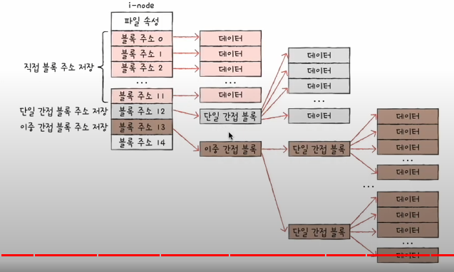

## 파티셔닝과 포메팅

운영체제에서 파일들을 저장할 때에는 보조기억장치를 통해 저장한다.

그리고 파일의 내용을 저장하는 단위는 운영체제를 기준으로 `블록`이라고 지칭한다.

- 물론 보조기억장치를 기준으로는 섹터 가 맞지만, 여러개의 섹터를 모은 집합을 운영체제가 관리하기에 그 섹터 여러개를 하나의 블록으로 생각하면 된다.

그러한 블록들 중 비슷한 정보들이 모여있는 집합이 바로 `파일`이라고 한다.

`디렉터리`는 속해있는 파일의 정보를 표시하기 위한 특별한 파일이다.

이러한 디렉토리의 정보를 저장하기 위해서 디렉토리는 `디렉토리 엔트리`라는 특별한 자료구조로 관리한다.

이렇게 파일과 디렉토리를 저장하기 위해서, 보조기억장치에 먼저 해줘야할 것이 `포메팅` 과 `파티셔닝` 이다.

### 파티셔닝

보조기억장치에 아무렇게나 파일 혹은 디렉토리를 넣어 저장하면, 나중에 찾을 때 분명 난잡할 것이다.

이를 위해서 논리적으로 보조기억장치의 영역을 나눈것을 파티셔닝이라고 한다.

- 참고로 하드웨어적인 파티셔닝도 있고 논리적인 파티셔닝도 있다. 여기서 말하는것은 논리적인 파티셔닝이다.

### 포매팅

파일 시스템의 종류를 결정하는 것이다. 

- 예시) NTFS, FAT32, Unix File System 등

이러한 파일 시스템의 종류에 따라 파일 혹은 디렉토리의 내용이 어떻게 블록에 할당되어 저장되는지를 결정한다.

참고로 포매팅은 논리적인 파티셔닝으로 나눠진 파티션마다 설정할 수 있다.

또한 포메팅의 종류별로 서로 다른 디렉터리 엔트리를 통해 블록을 할당한다.

## 파일 시스템에 대한 이해

파일 시스템에는 크게 `연속 할당` 방식과 `불연속 할당` 방식이 있다.

오늘날 대부분의 OS의 파일 시스템은 불연속 할당 방식을 사용한다.

### 연속 할당 방식

연속할당은 단순하게 어떤 파일이나 디렉토리에 대해서 블록들을 연속적으로 할당하는 방식을 의미한다.

할당할 때에 필요한 것은 시작 블록의 주소와 블록의 개수를 디렉토리 엔트리에 저장한다.

예를들어 파일 A을 운영체제가 15번 블록을 기준으로 5개 저장한다고 하면
디렉토리 엔트리에 "파일명, 15번, 5개" 로 저장되게 된다.

당연하게도 연속 메모리 할당과 비슷하게 외부 단편화를 야기시킬 수 있기 때문에 오늘날엔 쓰이지 않는다.

## 불연속 할당 방식

불연속 할당 방식에는 `색인 할당 방식`과 `연결 할당 방식` 으로 나뉘며

`색인 할당 방식`은 파일의 정보가 담긴 블록들의 주소를 어떤 하나의 블록에 저장하고, 해당 블록과 파일이름을 디렉토리 엔트리에 저장하는 방식이다.

따라서 디렉토리 엔트리에 블록들을 저장하는 "색인 블록의 주소"와 함께 저장된다.

`연결 할당 방식`은 연결리스트 자료구조를 활용하여 하나의 파일 혹은 디렉토리를 이루는 블록들을 연결하는 방식이다.

따라서 디렉토리 엔트리에 "첫번째 블록주소, 길이" 로 저장된다.

`연결 할당 방식`은 당연하게도 연결리스트 자료구조로 인해 특정 블록에 도달하는데에 시간이 걸릴 수 있으며, 블록들이 다음 블록의 주소를 저장해야 하는 문제가 있다.

`색인 할당 방식`은 파일에 등록된 블록 하나를 읽으면 모든 파일의 정보를 읽을 수 있다.

`연결 할당 방식`의 단점을 일부 보완한 방식으로 `FAT` 가 있다.

`색인 할당 방식`의 예시로는 `Unix File System`이 있다.

### FAT (File Allocation Table)

오늘날에서도 작은 용량의 보조기억장치(USB 등)의 파일시스템으로 사용된다.

기존의 연결 할당 방식에서 "파일을 이루는 블록은 다음 블록의 주소를 기억해야 한다." 가 상당히 낭비된다는점을 파악하여

`블록별 다음 블록주소를 관리하는 테이블`인 `File Allocation Table` 공간을 별도로 관리하는 시스템이다.

따라서 블록들이 다음 블록주소를 기억할 필요가 없다.

또한 연결리스트의 단점을 보완하기 위해 일부 메모리위에 캐싱해놓기도 한다.

- 참고로 FATOO 에서 숫자는 블록의 크기를 나타낸다.

아래의 사진이 FAT 파일 시스템의 파티셔닝을 간략화 한 것이다.

- 참고로 FAT12 를 기준이다.

그리고 `루트 디렉토리 영역`에서 별도로 루트 디렉토리를 관리하는것도 특징이다.

또한 디렉토리 엔트리는 다음과 같이 저장된다.

여기서 파일의 종류를 나타내는 `속성 컬럼`(숨김 파일, 시스템 파일, 디렉토리 여부 등)이 있다는 것 과 시작 블록의 주소를 저장하기 위한 `시작 블록` 컬럼이 있다는것이다.

**FAT 방식에서 경로상의 파일을 읽어들이는 과정**

젤 처음 "home" 디렉토리는 루트 디렉토리 영역의 서브 디렉토리이기 때문에, 루트("/") 디렉토리 영역에서 디렉토리 엔트리를 확인한다.

루트 디렉토리 영역에서 찾고자하는 `home`이라는 파일명을 확인하고 그에 따른 시작 블록 주소(3번)을 기준으로 블록 끝까지 읽으러 간다

3번 블록을 읽음으로서 home 파일이 디렉토리임이 확인되고(속성), home 
디렉토리 엔트리내에 다음으로 확인해야할 파일명인 minchul 을 찾는다.

minchul이 home 디렉토리 엔트리에서 발견되고, minchul 파일을 구성하는 블록의 시작주소(15번)로 부터 블록들을 읽는다.

15번 주소를 기준으로 읽어들여, minchul이 디렉토리임이 확인되었고, 그 내부 파일들이 a.sh, b.c, c.tar 이 있음을 확인하였다.

minchul 디렉토리 엔트리내에 현재 접근하고자 하는 다음 파일인 a.sh를 확인할 수 있고 그의 시작블록 주소(9번)로부터 블록들을 읽어들인다.

### Unix File System

색인 할당 방식의 예시로서 `i-node`라는 개념의 `색인 블록`을 통해 해당 파일을 구성하는 모든 블록들을 읽어들이게 된다.

다음으로는 `Unix File System`에서 갼략화된 파티셔닝 내용이다.

위에서 볼 수 있는 주요 특징으로는 FAT와 달리 루트 디렉토리를 별도로 관리하지 않는다는 것

그리고 FAT는 FAT를 관리하는 영역이 잇듯, i-node를 별도로 관리하기 위한 영역이 i-node 영역으로 있다는 점이다.

그래서 디렉토리 엔트리의 형태는 다음과 같이 i-node 번호와 대응되는 파일명으로 엔트리가 구성된다.

그런데 `Unix File System`에서는 15개의 블록으로 하나의 파일을 관리한다.

그럼 여기서 15개 이상의 블록을 요구하는 파일이면 어떻하게 되는가?

`Unix File System`에서는 몇가지 규칙이 있다.

1. 블록의 개수에서 12개를 넘어선다면, 13번째에는 `단일 간접 블록`의 주소가 저장된다.
- 단일간접블록이란 또다른 블록들을 모아놓는 블록이 된다.
- 

2. 1번으로도 모자라다면 14번째에는 `이중 간접 블록`의 주소가 저장된다.
- 이중간접블록이란 단일간접블록들의 주소들을 저장하는 블록이다.
- 

3. 2번으로도 모자라다면 15번째에는 `삼중 간접 블록`의 주소가 저장된다.
- 삼중간접블록이란 이중간접블록들의 주소들을 저장하는 블록이다.
- 여기까지오면 왠만한 크기의 파일은 저장할 수 있다.
- 

**Unix File System 방식에서 경로상의 파일을 읽어들이는 과정**

위에서 언급하였듯, Unix File System 방식의 파티셔닝에는 루트 디렉토리를 별도로 관리하지 않는다.

즉, "/" 바로 아래의 디렉토리들의 정보가 담겨있는 디렉토리 엔트리를 별도로 분리해놓지 않는다.

그 대신 **Unix File System 에서는 루트 디렉토리의 정보가 담긴 i-node번호를 항상 기억**하고 있다.

따라서 "/" 디렉토리의 정보를 곧바로 읽을 수 있다.

그래서 읽어들이면 home, bin, etc 디렉토리의 정보가 나오고, 해당 정보가 모여있는 색인 블록인 i-node 번호를 알 수 있다.

여기서 home에 해당하는 i-node 번호(3번)로 찾아가서 색인 블록내에 모든 블록들을 읽는다.

그렇게 home 디렉토리에 대한 내용을 읽고 home의 디렉토리 엔트리를 확인해보면 minchul 과 guest 라는 파일과 i-node 번호들을 알 수 있다.

찾아가고자 하는 minchul의 i-node(8번) 번호를 색인 블록을 찾아 읽고, 색인 블록을 통해 파일의 내용을 읽어들인다.

그리고 minchul을 읽어들이고 minchul 디렉토리 엔트리를 확인하면 
a.sh, b.c, c.tar 파일들과 각각의 i-node 번호를 확인 할 수 있다.

찾고자 하는 a.sh의 i-node 번호(9번)를 따라 읽고 그 속의 색인 블록을 읽어서 파일의 내용을 읽어들인다.
