## 프로세스

프로세스는 실행 중인 프로그램을 이야기한다.

포그라운드 프로세스: 사용자가 볼 수 있는 공간에서 실행되는 프로세스

그러면 안보이면? 백그라운드 프로세스 

백그라운드 프로세스 중에서 사용자와 상호작용이 가능한게 있고 불가능한게 있는데

그중에서 묵묵히 할일만 수행하는 프로세스를 데몬, 서비스라고 부른다.

### 커널영역의 프로세스와 사용자 영역의 프로세스

모든 프로세스는 CPU 자원을 필요로 하고, 자신의 차례에 정해진 시간만큼만 CPU를 양보하거나

타이머 인터럽트가 발생하면 차례를 양보해야한다.

- 프로세스에 대하여 CPU 자원을 할당할 때 일정 시간을 매기는것을 **타이머**라고 부른다.
- 그러다가 타이머가 0이 되면 타이머(타임아웃) 인터럽트이 발생하여 CPU자원에 대한 제어를 운영체제에게 반납하게 된다.
- 즉, 하나의 프로세스가 CPU자원을 독점하지 못하게 막는 인터럽트라고 생각하면됨

**PCB(Process Control Block)**: 빠르게 번갈아 수행되는 프로세스를 운영체제가 관리하기 위한 자료구조

- 프로세스 생성 시 커널 영역에 생성, 종료 시 폐기

PCB에는 다음과 같은 정보들이 담긴다

- PID(ProcessId)
- Register 값
    - 모든 프로세스는 실행되기 위해서 CPU자원을 사용해야 하지만, CPU자원을 항상 사용할 수는 없다.(인터럽트에 의해)
        - CPU를 사용하는동안 명령어를 처리하기 위해 프로그램 카운터, 명령어 레지스터 등을 사용한다.
    - 그러다가 타이머 인터럽트가 발생하면 이러한 레지스터 값들을 저장해둬야 다음번에 실행할 때 마저 처리할 수 있다.
    - 그래서 레지스터 값 이라는 영역이 PCB에 존재하게 된다.
- Process 상태
    - 입출력 장치를 사용하기 위해 기다리는 상태, CPU를 사용하기 위해 기다리는 상태 등의 프로세스 상태를 가리킴
- CPU 스케쥴링 정보
    - 지금 프로세스가 언제, 어떤 순서로 CPU자원을 할당받을지에 대한 정보
- 메모리 정보 
    - 이 프로세스가 메모리의 어떤 주소에 저장되어 있는지에 대한 정보
    - 페이지 테이블 정보
- 사용한 파일과 입출력장치 정보
    - 할당된 입출력 장치, 사용 중인 파일 정보

**컨텍스트 스위칭**

- 하나의 프로세스에서 다른 프로세스로 실행 순서가 넘어가면?

- 기존에 실행되던 프로세스는 지금까지의 중잔 정보를 백업
    - 아까 말했던 PCB를 사용해서 레지스터 값, 사용한 파일 입출력 정보 메모리 정보 등을 저장한다.
    - 이러한 중간정보를 컨텍스트라고 한다.
- 그리고 다른 프로세스의 중간정보를 복구하여 실행중인 프로세스를 교체한다.

결국 본인 프로세스가 처리된 순간까지의 레지스터 값, PC, 메모리 정보, 사용한 파일 입출력장치 정보를 PCB에 넣고

다른 프로세스의 PCB에 있는 정보를 들고와서 CPU에 세팅해서 동작시키면 문맥교환이 이루어진 것

즉, 커널에서는 프로세스를 관리하는 체계로 PCB를 사용하고

사용자 영역에서의 프로세스는 메모리구조로서 스택 영역, 힙 영역, 데이터 영역, 코드 영역을 가진다.

- 코드영역: CPU가 실행할 명령어가 담기기에 read-only 영역
- 데이터 영역: 프로그램이 실행되는 동안 유지할 데이터 저장
- 힙 영역: 프로그래머가 직접 할당할 수 있는 저장공간 (가변적으로 변할 수 있다.)
- 스택 영역: 데이터가 일시적으로 저장되는 공간 (가변적으로 변할 수 있다.)
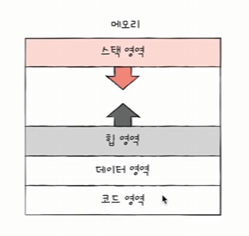

### 프로세스의 상태

- 생성
    - 이제 막 메모리에 적재되어 PCB를 할당 받은 상태
    - 생성이 완료되면 준비상태로 전이됨

- 준비(WAIT)
    - 자신의 차례를 기다리는 상태
    - 자신의 차례가 된다면 실행 상태로 전이됨(이걸 Dispatch 라고 부름)

- 실행(RUNNING)
    - CPU를 할당 받아 실행 중인 상태
    - 할당된 시간을 전부 사용하여(타이머 인터럽트 발생 시) 준비 상태로
    - 실행 도중 입출력 장치를 사용하는 경우 대기 상태로

- 대기(BLOCK)
    - RUNNING 상태의 프로세스가 입출력장치를 사용하는경우 전이되는 상태
    - 입출력 장치가 끝나면 실행이 아닌 준비 상태로 진입

- 종료(TERMINATED)
    - 프로세스 종료된 상태
    - PCB, 프로세스의 메모리 영역 정리

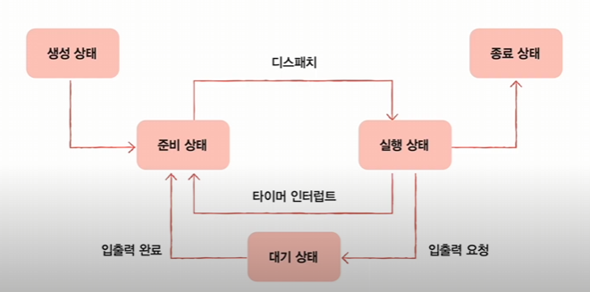

### 프로세스 계층 구조

프로세스 실행 도중 다른 프로세스 생성 가능 `fork()` (엄밀하게 따지면 윈도우는 자식 프로세스 생성 기능이 없다.)

새 프로세스를 생성하면 부모 프로세스가 되고 부모 프로세스에 의해 생성된 프로세스를 자식 프로세스가 된다.

부모 프로세스와 자식 프로세스는 별개의 프로세스이므로 각기 다른 PID를 가짐, 일부 운영체제에서는 자식 프로세스 PCB에 부모 프로세스 PID인 PPID를 명시하기도 함

**프로세스 생성기법**

부모 프로세스는 자식 프로세스를 어떻게 만들어내고, 자식 프로세스는 어떻게 자신만의 코드를 실행할까?

해당 프로세스와 동일한 메모리 영역 내용을 가지는 프로세스를 만들어내고 PPID를 자신을 만들어준 프로세스의 PID로 기록된다. (그야말로 여기까진 복제된 프로세스다.)

그리고 `exec()`라는 시스템 콜을 통해 해당 자식프로세스가 실행할 프로그램을 위한 메모리 영역으로 덮어씌우게 된다.

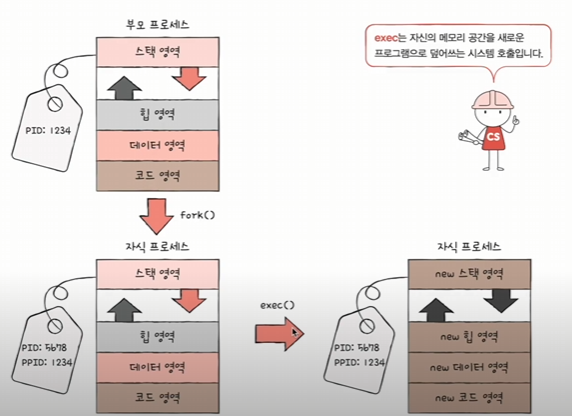
```
만약에 사용자가 bash라는 쉘 프로세스에서 ls라는 명령어를 실행했다고 가정해보자.

그러면 bash 쉘 프로세스는 fork라는 시스템 콜을 통해 bash 프로세스의 자식 프로세스를 만들어내고

exec() 시스템콜을 통해 ls를 실행하기 위한 메모리 공간을 덮어씌워서 실행한다.
```

## 스레드

**스레드는 프로세스를 구성하는 실행 흐름의 단위**

실행 흐름이 여러 개 인 프로세스 (멀티 스레드 프로세스)

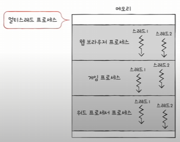

스레드의 구성 요소

- 스레드는 실행에 필요한 최소한의 정보만을 담고 있다.

- 스레드 ID
- PC를 포함한 여러 레지스터 값
- 스택 등

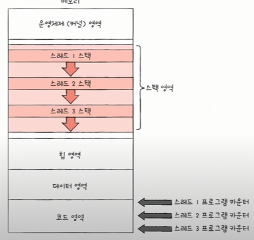

위 그림상으로 각 스레드별 PC카운터가 코드영역을 가리키고 있는데

왜냐하면 스레드는 실행 흐름의 단위이므로 하나의 프로세스내에 여러 스레드가 있 병렬로 돌아가고 있다면, 각 스레드별로 서로다른 코드 영역내 기계어를 동시에 실행하고 있을것이다.

각 스레드들은 프로세스의 자원을 공유하여 사용하기도 한다.

위 그림을 보면 하나의 코드의 영역에서 여러 스레드 들이 자원을 나눠서 점유한다.

즉, 코드영역과 힙, 데이터 영역을 **공유**하게 된다.

참고: 리눅스에서의 스레드

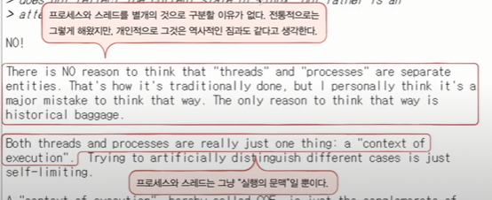

## 멀티 프로세스와 멀티 스레드

동일한 작업을 수행하는 단일 스레드를 가진 프로세스를 여러 개 실행 vs 하나의 프로세스를 여러 스레드로 실행

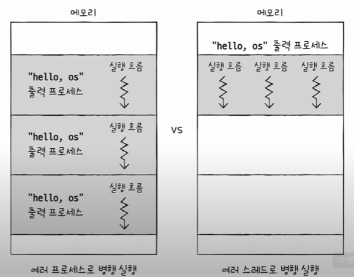

프로세스끼리는 기본적으로 자원을 공유하지 않지만, 스레드는 같은 프로세스내에 자원을 공유한다(데이터 영역, 코드 영역, 힙 영역)

멀티 프로세스를 먼저 살펴보자면

- 프로세스를 `fork` 하면 코드/데이터/힙 영역 등 모든 자원이 복제되어 저장됨
- 저장된 메모리 주소를 제외하면 모든 것이 동일한 프로세스 두 개가 통째로 메모리 적재
- 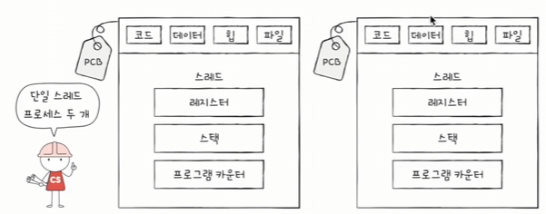
```
참고) fork 한 직후 프로세스를 통째로 메모리 중복 저장하지 않고서

동시에 자원을 공유하지 않게 하는 방법으로 `copy on write` 기법이 있다.
```

-> Java에 CopyOnWriteArrayList랑 같은거일듯

멀티 스레드를 살펴 보자면

- 각 스레드들은 각기 다른 스레드ID, (별도의 실행을 위해 꼭 필요한) 프로그램 카운터 값을 포함한 레지스터 값, 스택을 가질 뿐 프로세스가 가지는 자원을 공유

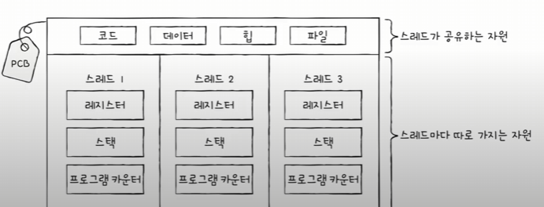

스레드간에는 결국 데이터, 힙, 코드영역을 공유하기 때문에 데이터의 변화를 즉각적으로 반응할 수 있지만 이것이 꼭 장점은 아니다.

프로세스간에는 일반적으로는 공유 데이터를 가지기 힘들지만 프로세스간 통신을 통해 어느정도 해소할 수 있다. 
- 소켓 방식, 공유 메모리 방식, 네임드 파이프라인 방식 등이 있다.

## 동기화

동시다발적으로 실행되는 프로세스들은 서로 협력하며 영향을 주고 받는다.

이 과정에서 **자원의 일관성**을 보장해야한다.

동기화의 명목

- 실행 순서 제어: 프로세스를 올바른 순서대로 실행하기
- 상호 배제: 동시에 접근해서는 안 되는 자원에 하나의 프로세스만 접근하게 하기

### 실행 순서 제어

Case: reader writer problem

```
Writer: Book.txt 파일에 값을 저장하는 프로세스
Reader: Book.txt 파일에 저장된 값을 읽어들이는 프로세스

Reader 프로세스는 'Book.txt 안에 값이 존재한다' 라는 특정 조건이 만족되어야만 실행 가능
```

### 상호 배제

Case1: Bank account problem

한 번에 하나의 프로세스만 접근해야 하는 자원에 동시 접근을 피하기 위한 동기화

```
현재 계좌에 잔액: 10만원
프로세스 A는 현재 잔액에 2만 원을 추가하는 프로세스
프로세스 B는 현재 잔액에 5만 원을 추가하는 프로세스

즉,

프로세스 A와 B 모두 동시에 다음의 행동을 수행한다.
1. 계좌의 잔액을 읽어 들인다.
2. 읽어 들인 잔액에 2만원을 더한다.
3. 더한값을 저장한다.

여기서 '계좌 잔액 == 17만' 이 성립할까?
```
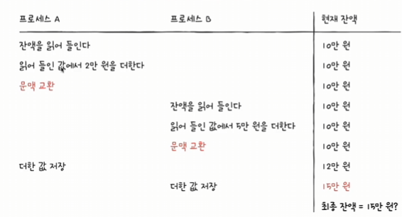

Case2: Producer & Consumer problem

```
물건을 계속 생산하는 생산자(producer, 프로세스 혹은 스레드)
물건을 계속 소비하는 소비자(consumer, 프로세스 혹은 스레드)

'총합' 변수 공유

즉,

생산자 () {
    버퍼에 데이터 삽입
    '총합' 변수 1 증가
}

소비자 () {
    버퍼에서 데이터 빼내기
    '총합' 변수 1 감소 
}

이 상태에서 생산자를 10만번 소비자를 10만번 동시 실행하면 '총합'은?
```

### Shared Resource & Critical Section (공유 자원 & 임계 구역)

공유 자원: 여러 프로세스 혹은 스레드가 공유하는 자원

임계 구역: 동시에 실행하면 문제가 발생하는 자원에 접근하는 코드 영역

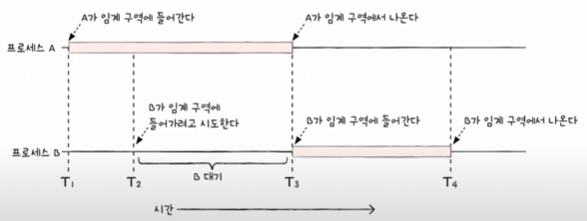

-> 임계 구역에 진입하고자 하면 진입한 프로세스 이외에는 대기해야 한다.

여기서 임계 구역에 동시에 접근하면 자원의 일관성이 깨질 수 있다.

이를 **Race Condition(경쟁 상태)** 라고 한다.

### 운영체제가 임계구역 문제를 해결하는 세 가지 원칙

-> 즉, 상호 배제를 위한 동기화를 위한 세 가지 원칙

1. 상호 배제: 한 프로세스가 임계 구역에 진입했다면 다른 프로세스는 들어올 수 없다.

2. 진행: 임계 구역에 어떤 프로세스도 진입하지 않았다면, 진입하고자 하는 프로세스는 들어갈 수 있어야한다.

3. 유한 대기: 임계구역에 들어오기 위해서 무한정 대기해서는 안 된다.

## 동기화 기법

### Mutex Lock

상호 배제를 윈한 동기화 도구(자물쇠 역할)

코드로 구현한다면 전역 변수 하나, 함수 두개로 구현가능

임계 구역을 잠그는 역할: `acquire` 함수

임계 구역의 잠금을 해제하는 역할: `release` 함수

```c
bool lock;

acquire() {
    while(lock) // 임계구역 대기
    lock = true; // 락을 걸고 진입
}

release() {
    lock = false; // 다썻으니 락 해제
}
```

```
사용 예시

acquire();
// 임계 구역 TODO
release();
```

하지만 위처럼 `while(lock)`으로 하면 무한정 대기하기 때문에 원칙 3번을 지키지 못한다.

### 세마포아: 상호 배제를 위한 동기화

뮤텍스 락은 임계구역이 하나만 있는 경우로 산정한 방식

공유자원이 그런데 여러개라면? 세마포를 사용한다. 

- 엄밀하게 따지자면 세마포는 2개지만 (이진 세마포, 카운팅 세마포) 일반적으로 카운팅 세마포를 지칭하므로 카운팅 세마포로 설명한다.

임계 구역 앞에서 멈춤 신호를 받으면 잠시 기다리기

임계 구역 앞에서 가도 좋다는 신호를 받으면 임계 구역 진입

구현은 아래와 같다.

```c
임계 구역에 진입할 수 있는 프로세스의 개수(공유 자원의 개수)를 나타내는 전역 변수 S

임계 구역에 들어가도 좋은지, 기다려야 할지를 알려주는 wait()

임계 구역 앞에서 기다리는 프로세스에 '가도 좋다'고 신호를 주는 signal()

static int S;

wait() {
    while(S <= 0) // 임계 구역에 진입가능한 프로세스의 수가 0 이하라면 대기

    S--; // 본인 프로세스가 진입하니까 진입가능한 프로세스수 1개 낮추고 진입
}

signal() {
    S++ // 자기가 할일을 마쳤으면 임계 구역에서 빠져나가기에 S를 다시 증가시킴
}
```

```
사용하는 예시

어떤 코드에서...

wait()
// 임계 구역내에 수행할 TODO
signal()
```


세마포 예제

```
세 개의 프로세스 P1, P2, P3가 두 개의 공유자원 (S = 2)에 P1, P2, P3 순서로 접근한다고 가정

1. P1 call wait(), S > 0 -> 2 - 1 -> S = 1, P1 enter Critical Section

2. P2 call wait(), S > 0 -> 1 - 1 -> S = 0, P2 enter Critical Section

3. P3 call wait(), S <= 0, wait for S > 0

4. P1 call signal(), 0 + 1 -> S = 1, P1 out Critical Section

5. P3 check S, S > 0, 1 - 1 -> S = 0, P3 enter Critical Section
```

- 문득 궁금한 점: 공유자원의 개수가 복수개일 때 사용가능하다는건데, 그럼 자원의 주인이 어떤프로세스 인지 명확하게 할 수 있음?

- 이에 대한 답: 뮤텍스는 가능하지만 세마포어는 자원의 주인을 명시하기 힘듬. 따라서 스레드풀이나 `producer-consumer` 등에서 사용함 

    - 스레드풀에서의 예시: 스레드 풀 내에서 스레드를 사용할 때, 스레드의 개수조절에서 세마포어를 사용한다고 한다. 공유자원은 스레드이고, 그러한 스레드가 여러개 있기에 뮤텍스보다는 세마포어를 사용한다.

    - `producer-consumer`: 단순하게 공유자원이 0보다 클때까지는 consumer가 대기하면 된다.

### Busy Waiting
 
세마포어도 뮤텍스도 결국 무한정 대기상태를 유지하게 되면

운영체제에서의 상호배제 원칙을 3번(`유한 대기`)에 의거하여 문제가 발생한다.

따라서 사용할 수 있는 자원이 없을 경우 `대기 상태`를 위한 대기큐에 삽입한다.

그러고 사용할 수 있는 자원이 생긴경우 대기 큐의 프로세스를 `준비 상태`를 위한 준비큐에 삽입한다.

이러한 방법을 구현한 수도 코드는 다음과 같다.

```c
wait() {
    S--;
    if (S < 0) {
        add this process to Wait Queue; // 현재 사용가능한 자원이 없다면 대기큐에 삽입하고
        sleep(); // 현재 프로세스를 대기상태로 만든다.
    }
}

signal() {
    S++; // 현재 프로세스가 할일을 마쳤다면 S값을 증가시키고
    if (S <= 0) {
        remove a process p from Queue // 증가시킴에도 불구하고 사용가능 자원이 0이하 라는것은 대기프로세스가 있다는 것
        wakeup(p); // 해당 프로세스를 준비상태로 만든다.
    }
}
```
```
사용하는 예시

어떤 코드에서...

wait()
// 임계 구역내에 수행할 TODO
signal()
```

이렇게 구현하면 위의 무한정 대기하는 진행순서에서 다음과 같이 달라진다.

```
S = 2 라고 가정
1. P1 call wait(), S -> S - 1 -> S = 1, go Critical Section
2. P2 call wait(), S -> S - 1 -> S = 0, go Critical Section
3. P3 call wait(), S -> S - 1 -> S = -1, sleep and go WaitQueue
4. P1 call signal(), S -> S + 1 -> S = 0, pop from WaitQueue and wakeup popped process
5. P2 call signal(), S -> S + 1 -> S = 1
6. P3 call signal(), S -> S + 1 -> S = 2
```

### 세마포아: 사용하는 실행 순서 동기화

- 세마포의 변수 `S` 를 `0` 으로 두고
- 먼저 실행할 프로세스 뒤에 `signal()` 
- 다음에 실행할 프로세스 앞에 `wait()` 붙이기

### 모니터: 실행 순서 동기화, 상호 배제를 위한 동기화

세마포어를 사용 할 때, 세마포를 누락한 경우, wait()과 signal() 순서를 헷갈리는 경우에 문제가 된다.

**상호 배제를 위한 동기화**

- 인터페이스를 위한 큐
- 공유 자원에 접근하고자 하는 프로세스를 큐에삽입
- 큐에 삽입된 순서대로 하나의 프로세스만 공유 자원 이용

**실행 순서 제어를 위한 동기화**

조건변수 이용

- 조건 변수: 프로세스나 스레드의 실행 순서를 제어하기 위해 사용하는 특별한 변수
    - 주의: 상호 배제를 위한 큐와 실행 순서를 위한 큐는 서로 다르다.
    - 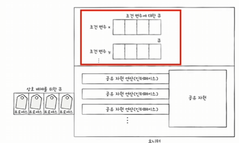


모니터 안에는 **하나의 프로세스**만이 존재할 수 있다

해당 모니터를 얻어서 연산하다가 `signal()` 호출되었을 때, 대 기큐에서 대기하고 있던 프로세스를 꺼내게 될 텐데, 다음의 두 가지 방식이 있다.

- wait()을 호출했던 프로세스는 signal() 을 호출한 프로세스가 모니터를 완전히 떠난 뒤에 수행을 재개

- signal()을 호출한 프로세스의 실행을 일시 중단시키고 자신이 실행된 뒤, signal()을 호출한 프로세스의 수행을 재개

